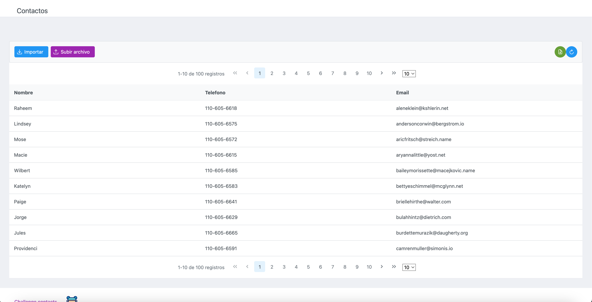
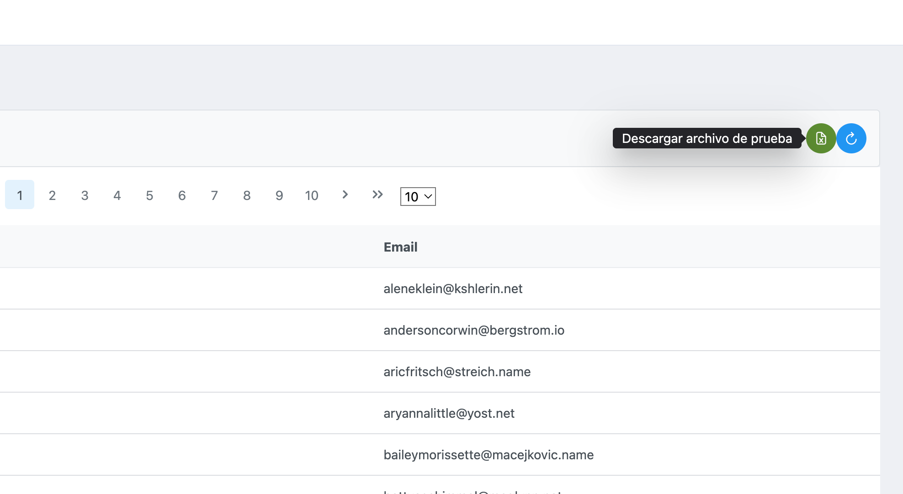
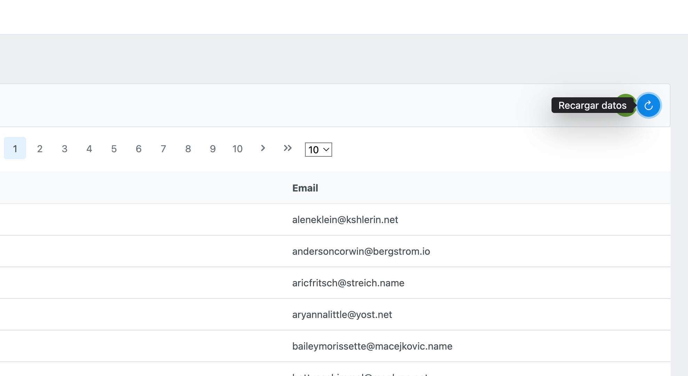
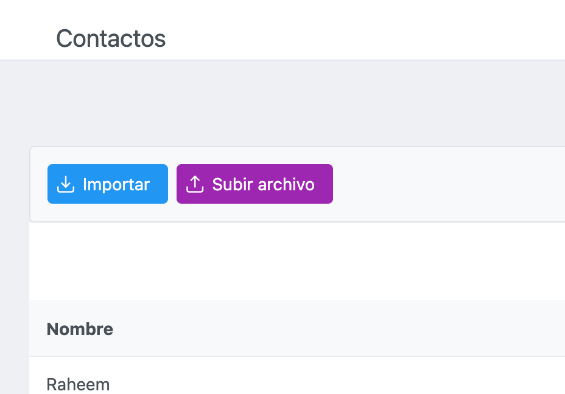

# Challenge
lista de contactos, el proyecto se realizo de forma intuitiva para utilizando una vista
para poder descar un ejemplo de la lista de contactos y subiendo el archivo alojado en el pc, también
se podrá visualizar lo que se ha importado

## Tecnologias

### Java 17
### Spring Boot
### Primefaces
### JoinFaces
### Maven


## Vista inicial del proyecto

### url: http://localhost:7070/challenge-contacts/home


## Compilación del proyecto

##### Clonar del repositorio
```
git clone -b master https://github.com/andresmen30/Project-Mutant.git
```

##### Compilar

Ubíquese en la ruta /challenge-contacts
```
mvn clean install
```

##### Desplegar

Ubíquese en la clase ChallengeContactsApplication y ejecute la clase main
```
package com.challenge.contacts;

import org.springframework.boot.SpringApplication;
import org.springframework.boot.autoconfigure.SpringBootApplication;

@SpringBootApplication
public class ChallengeContactsApplication {

   public static void main(String[] args) {
      SpringApplication.run(ChallengeContactsApplication.class, args);
   }

}

```
## Imagenes del proyecto







